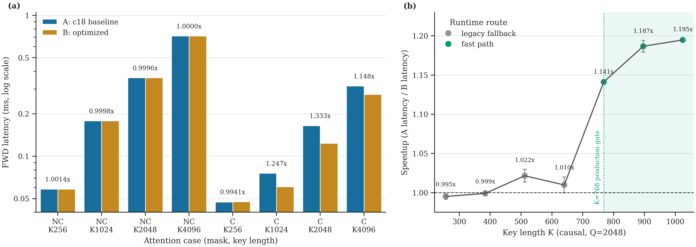
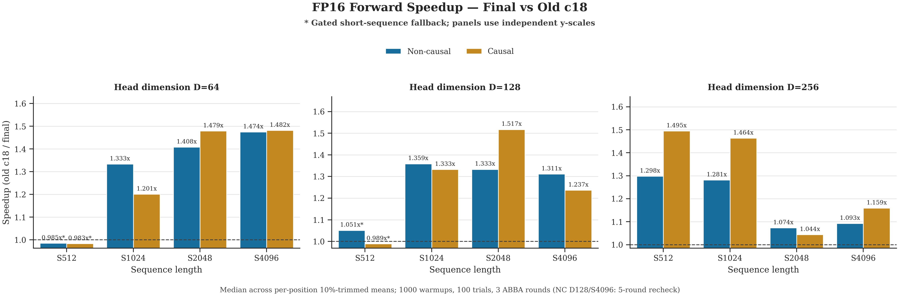
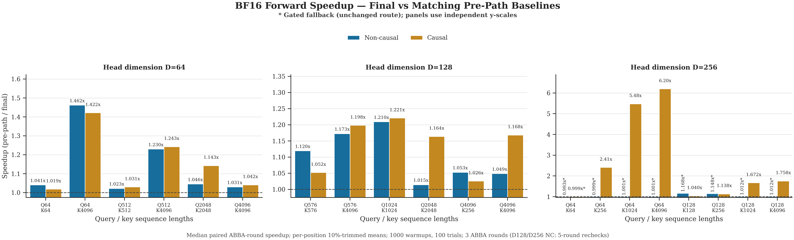
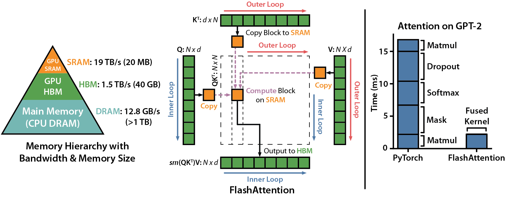
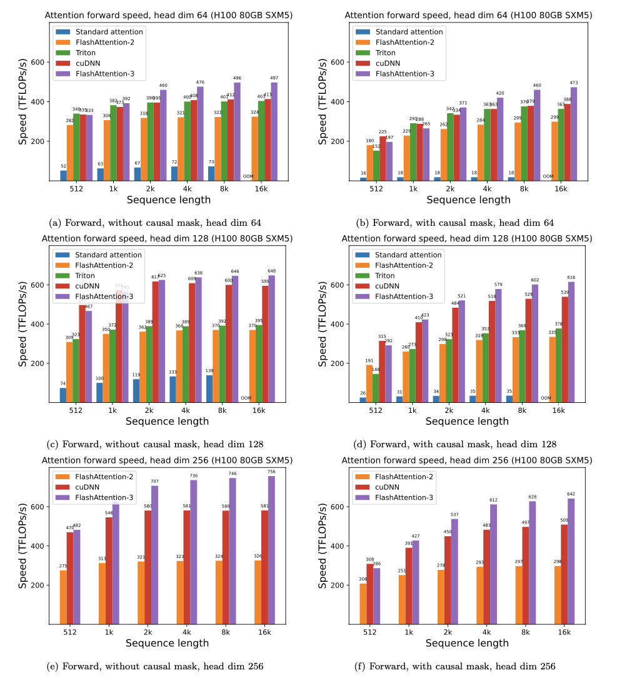
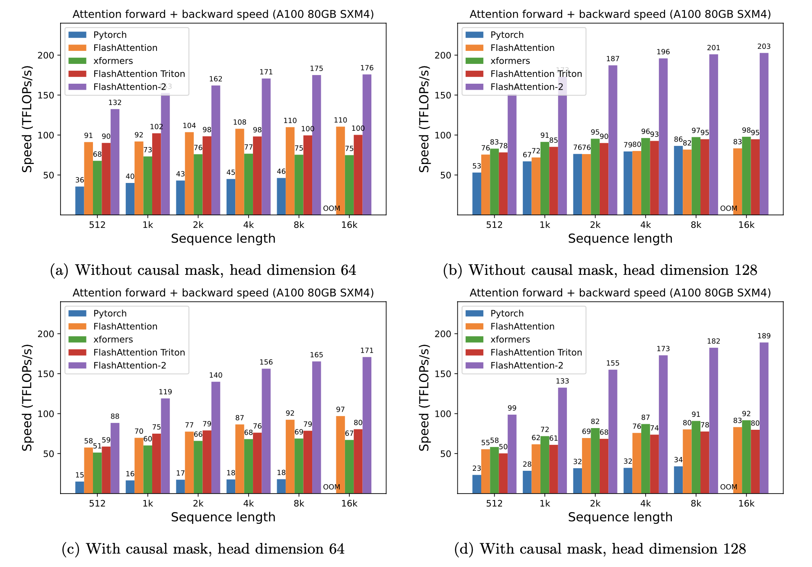
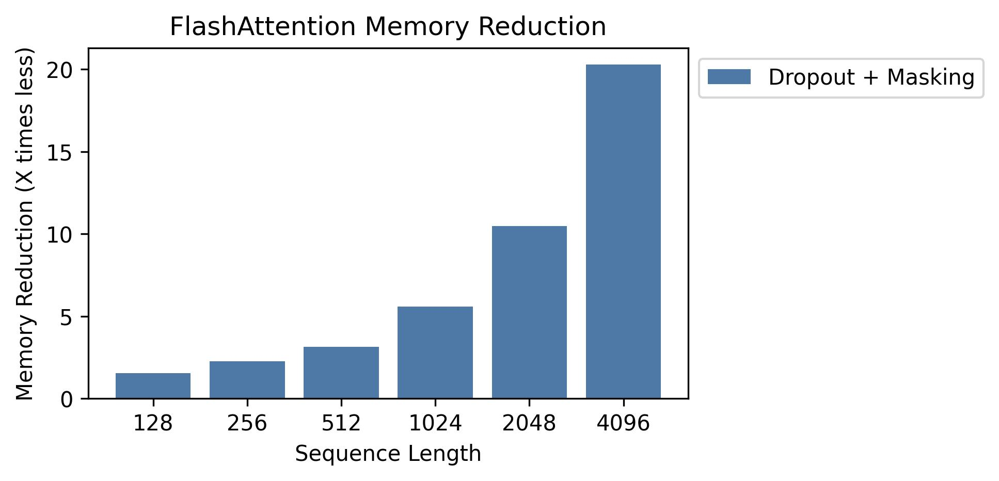
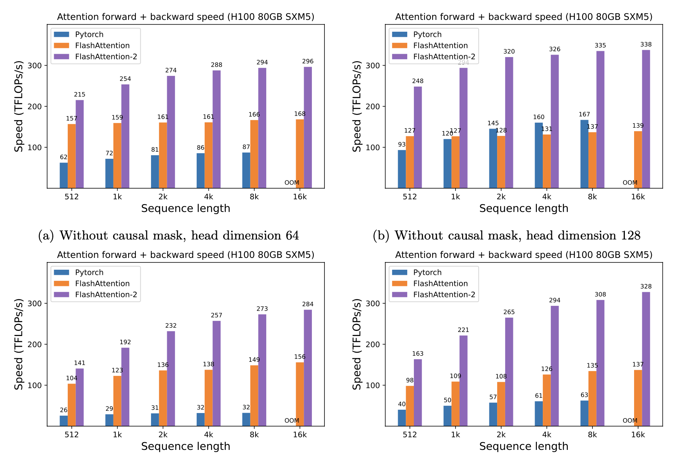

# FlashAttention

## Frozen RDNA3 / ROCm CK source snapshot

This repository snapshot carries its required Composable Kernel, CUTLASS,
rocThrust, and rocPRIM sources directly under `csrc/`; it has no Git submodule
setup step and does not download source dependencies while building. ROCm, a
matching ROCm-enabled PyTorch installation, and the Python build tools remain
external prerequisites.

The validated release target is RDNA3 `gfx1100`, with the release artifact
tested against PyTorch ROCm 7.2 and a matching ROCm 7.2 / Clang 22 toolchain.
The ROCm compiler major/minor version should match the ROCm version used by
PyTorch; a newer compiler may build successfully while changing performance.

### Build and install from source

The recommended installation path builds the complete frozen kernel set into a
local wheel and then installs that wheel without resolving or replacing the
existing ROCm/PyTorch environment:

```bash
git clone https://github.com/HUSRCF/flash-attn-rocm-rdna3.git
cd flash-attn-rocm-rdna3

python -m pip install -r requirements-build.txt
make doctor
make freeze-check
make wheel MAX_JOBS=8
python -m pip install --no-deps --force-reinstall dist/*.whl
```

`MAX_JOBS` controls parallel compilation. Increase it on a machine with enough
host memory, for example `MAX_JOBS=64`, or reduce it if the compiler processes
are killed. The full CK build is intentionally large. It uses the vendored
sources under `csrc/` and does not require `git submodule update`.

`make doctor` reports the PyTorch ROCm runtime and the compiler ROCm version
separately. On the validation host, the active PyTorch package is ROCm 7.2
while `/opt/rocm` is ROCm 7.14. The commands above use the host 7.14 compiler
and can produce a functional wheel, but that rebuild is not the accepted
ROCm-7.2/Clang-22 performance artifact. Use a ROCm compiler matching
`torch.version.hip` when release-comparable performance is required.

Verify the installed package from outside the source checkout so the local
Python directory cannot shadow `site-packages`:

```bash
cd /tmp
python - <<'PY'
import torch
import flash_attn
import flash_attn_2_cuda

print("torch:", torch.__version__, "ROCm:", torch.version.hip)
print("flash_attn:", flash_attn.__file__)
print("extension:", flash_attn_2_cuda.__file__)
PY
```

Import `torch` before `flash_attn_2_cuda` so the PyTorch extension libraries are
already loaded.

### Build and test without installing

For a small compiler and GPU smoke test, followed by the complete in-place
build:

```bash
make doctor
make vendor-check
make test-smoke
make build-full MAX_JOBS=8
make assert-local-full-extension
```

`make test-smoke` builds the minimal closure before testing it. Use
`make test-release` to build and test the frozen full kernel set, or
`make build-full` when only compilation is wanted.

### Install the prebuilt release bundle

The matching CPython 3.12 / PyTorch ROCm 7.2 / `gfx1100` release tarball is
tracked at the repository root, so a normal clone already contains it. It can
be installed without compiling:

```bash
tar -xzf flash_attn_fa4_c18_prebuilt_gfx1100_py312_rocm72.tar.gz
cd flash-attn-fa4-prebuilt
PYTHON=python ./scripts/install_prebuilt_flash_attn_ck.sh check
PYTHON=python ./scripts/install_prebuilt_flash_attn_ck.sh install
```

The installer checks Python 3.12, PyTorch 2.12 with its ROCm 7.2 runtime, and
the visible `gfx1100` GPU before copying the package and extension. The
`rocm72` filename refers to the PyTorch/runtime ABI used by the binary, not the
unused system compiler: this host may expose ROCm 7.14 under `/opt/rocm`, but
the prebuilt install does not invoke it.

### Validated A/B performance



Panel (a) compares absolute FWD latency in the final full-package ABBA sweep.
Panel (b) shows the higher-repeat causal K-boundary sweep and the production
K=768 fast-path gate. A is the pre-change c18 package and B is the final package;
speedup is `A latency / B latency`, so values above 1 mean B is faster.

| Protocol | Mask | Q | K | Runtime route | A baseline (ms) | B optimized (ms) | Speedup | Speedup gain | ABBA round range |
|---|---:|---:|---:|---|---:|---:|---:|---:|---:|
| Full-package | Non-causal | 2560 | 256 | Legacy fallback | 0.058389 | 0.058306 | 1.0014x | +0.14% | 1.0002–1.0026x |
| Full-package | Non-causal | 2560 | 1024 | Legacy fallback | 0.178162 | 0.178189 | 0.9998x | -0.02% | 0.9987–1.0010x |
| Full-package | Non-causal | 2560 | 2048 | Legacy fallback | 0.360059 | 0.360209 | 0.9996x | -0.04% | 0.9995–0.9997x |
| Full-package | Non-causal | 2560 | 4096 | Legacy fallback | 0.713458 | 0.713440 | 1.0000x | +0.00% | 0.9994–1.0007x |
| Full-package | Causal | 2048 | 256 | Legacy fallback | 0.047241 | 0.047521 | 0.9941x | -0.59% | 0.9883–0.9999x |
| Full-package | Causal | 2048 | 1024 | Fast path | 0.075716 | 0.060750 | 1.2466x | +24.66% | 1.2250–1.2687x |
| Full-package | Causal | 2048 | 2048 | Fast path | 0.164891 | 0.123702 | 1.3333x | +33.33% | 1.3069–1.3602x |
| Full-package | Causal | 2048 | 4096 | Fast path | 0.315022 | 0.274334 | 1.1484x | +14.84% | 1.1322–1.1648x |
| K-boundary | Causal | 2048 | 256 | Legacy fallback | 0.047100 | 0.047333 | 0.9951x | -0.49% | 0.9916–0.9986x |
| K-boundary | Causal | 2048 | 384 | Legacy fallback | 0.047143 | 0.047188 | 0.9991x | -0.09% | 0.9959–1.0022x |
| K-boundary | Causal | 2048 | 512 | Legacy fallback | 0.048753 | 0.047721 | 1.0215x | +2.15% | 1.0135–1.0297x |
| K-boundary | Causal | 2048 | 640 | Legacy fallback | 0.048746 | 0.048266 | 1.0098x | +0.98% | 0.9997–1.0200x |
| K-boundary | Causal | 2048 | 768 | Fast path | 0.053019 | 0.046461 | 1.1411x | +14.11% | 1.1401–1.1422x |
| K-boundary | Causal | 2048 | 896 | Fast path | 0.059990 | 0.050553 | 1.1867x | +18.67% | 1.1793–1.1941x |
| K-boundary | Causal | 2048 | 1024 | Fast path | 0.066926 | 0.056019 | 1.1947x | +19.47% | 1.1932–1.1962x |

The fast path provides a reproducible 1.141x–1.333x speedup in its validated
causal region, corresponding to approximately 12.4%–25.0% lower latency.
Non-causal full-package points remain within 0.15% of the baseline. K512 and
K640 still use the legacy fallback, so their positive values must not be
attributed to the fast kernel. Both protocols used 500 warmups, 20 kernel
iterations per trial, two ABBA rounds, and a 10% trimmed mean; the full sweep
used 50 trials per binary position and the K-boundary sweep used 100.

The measurements used physical GPU1, an AMD Radeon Pro W7900 Dual Slot
(`gfx1100`), FP16, and head dimension 128. Full-package non-causal cases used
B1H8; full-package causal and K-boundary cases used B1H4.

The checked-in source data is
[`benchmarks/results/c18_fastpath_ab_20260808.csv`](benchmarks/results/c18_fastpath_ab_20260808.csv),
and the figure can be regenerated with:

```bash
python scripts/plot_c18_fastpath_ab.py
```

### FP16 forward across head dimensions



This cumulative comparison measures the current final package against the
original old-c18 binary across FP16 forward, D64/D128/D256, non-causal and
causal attention, and square S512/S1024/S2048/S4096 cases. The geometric-mean
speedup across all 24 cases is 1.253x; the per-dimension geometric means are
1.277x for D64, 1.256x for D128, and 1.228x for D256. The four D64/D128 S512
bars are gated short-sequence fallback controls and are marked with an
asterisk. Their 0.983x–1.051x spread is measurement noise around the retained
route, not a fast-path regression. Keeping these controls in the figure makes
the dispatch boundary visible; for D64/D128, the optimized sequence-length
bars begin at S1024. Every measured D256 aggregate is positive.

Measurements used B2H4 on physical GPU1 (`gfx1100`). Each bar is the ratio of
the medians of six process-level measurements per package; each process-level
measurement is a 10%-trimmed mean over 100 trials after 1000 warmups, with 20
kernel calls per trial. The positions come from three balanced ABBA rounds.
The initially load-contaminated non-causal D128/S4096 point was replaced by a
separate five-round, ten-position recheck, which measured 1.311x with a
1.270x–1.379x round range.

The checked-in source data is
[`benchmarks/results/fp16_fwd_abba_20260808.csv`](benchmarks/results/fp16_fwd_abba_20260808.csv).
The data and figure can be regenerated from the local raw ABBA outputs with:

```bash
python scripts/summarize_fp16_fwd_abba.py
python scripts/plot_fp16_fwd_abba.py
```

### BF16 forward across head dimensions



This cumulative comparison uses exactly the same square sequence matrix and
x-axis as the FP16 figure: S512, S1024, S2048, and S4096 in every D64, D128,
and D256 panel, with both non-causal and causal bars. It compares the current
final package directly with the original old-c18 binary. The geometric-mean
speedup across all 24 cases is 1.399x; the per-dimension geometric means are
1.420x for D64, 1.496x for D128, and 1.289x for D256.

The 14 enabled fast-path bars are all positive, with a 1.503x geometric mean
and a 1.029x–1.992x range. Asterisks mark cases that do not enter the relevant
new BF16 fast path: D128/S512 and all square D256 cases. The D256 causal
specialization is restricted to short query lengths, while the non-causal
D256 alternative was rejected, so neither belongs to this common S512+
square matrix. Their positive cumulative package ratios remain visible, but
must not be attributed to those gated BF16 paths. The earlier short-Q D256
specialization results are intentionally excluded instead of mixing different
Q/K indicators into this directly comparable figure.

Measurements used B2H4 on physical GPU1 (RDNA3 `gfx1100`), 1000 warmups, 100
trials, and 20 kernel calls per trial. Each package latency is the median of
six process-level measurements; each position is a 10%-trimmed mean of its
trials. All bars use three balanced ABBA rounds. No temperature-based
exclusion was applied.

The checked-in source data is
[`benchmarks/results/bf16_fwd_abba_20260808.csv`](benchmarks/results/bf16_fwd_abba_20260808.csv).
The data and figure can be regenerated from the local raw ABBA outputs with:

```bash
python scripts/summarize_bf16_fwd_abba.py
python scripts/plot_bf16_fwd_abba.py
```

See
[BUILDING_ROCM.md](BUILDING_ROCM.md) for offline builds, dependency
provisioning, release-profile rules, and source-archive contents. For this
snapshot, use those Make targets and the build guide as the installation and
support contract. The commands below this notice are broader upstream
FlashAttention documentation; in particular, generic package-index installs
and upstream device lists do not describe this frozen RDNA3 release.

This repository provides the official implementation of FlashAttention and
FlashAttention-2 from the
following papers.

**FlashAttention: Fast and Memory-Efficient Exact Attention with IO-Awareness**  
Tri Dao, Daniel Y. Fu, Stefano Ermon, Atri Rudra, Christopher Ré  
Paper: https://arxiv.org/abs/2205.14135  
IEEE Spectrum [article](https://spectrum.ieee.org/mlperf-rankings-2022) about our submission to the MLPerf 2.0 benchmark using FlashAttention.


**FlashAttention-2: Faster Attention with Better Parallelism and Work Partitioning**  
Tri Dao

Paper: https://tridao.me/publications/flash2/flash2.pdf


## Usage

We've been very happy to see FlashAttention being widely adopted in such a short
time after its release. This [page](https://github.com/Dao-AILab/flash-attention/blob/main/usage.md)
contains a partial list of places where FlashAttention is being used.

FlashAttention and FlashAttention-2 are free to use and modify (see LICENSE).
Please cite and credit FlashAttention if you use it.


## FlashAttention-3 beta release
FlashAttention-3 is optimized for Hopper GPUs (e.g. H100). 

Blogpost: https://tridao.me/blog/2024/flash3/

Paper: https://tridao.me/publications/flash3/flash3.pdf



This is a beta release for testing / benchmarking before we integrate that with
the rest of the repo.

Currently released:
- FP16 / BF16 forward and backward, FP8 forward

Requirements: H100 / H800 GPU, CUDA >= 12.3.

We highly recommend CUDA 12.8 for best performance.

To install:
```sh
cd hopper
python setup.py install
```
To run the test:
```sh
export PYTHONPATH=$PWD
pytest -q -s test_flash_attn.py
```
Once the package is installed, you can import it as follows:
```python
import flash_attn_interface
flash_attn_interface.flash_attn_func()
```

## FlashAttention-4 (CuTeDSL)

FlashAttention-4 is written in CuTeDSL and optimized for Hopper and Blackwell GPUs (e.g. H100, B200).

To install:
```sh
pip install flash-attn-4
```

Once installed, you can use it as follows:
```python
from flash_attn.cute import flash_attn_func

out = flash_attn_func(q, k, v, causal=True)
```

## Installation and features
**Requirements:**
- CUDA toolkit or ROCm toolkit
- PyTorch 2.2 and above.
- `packaging` Python package (`pip install packaging`)
- `psutil` Python package (`pip install psutil`)
- `ninja` Python package (`pip install ninja`) *
- Linux. Might work for Windows starting v2.3.2 (we've seen a few positive [reports](https://github.com/Dao-AILab/flash-attention/issues/595)) but Windows compilation still requires more testing. If you have ideas on how to set up prebuilt CUDA wheels for Windows, please reach out via Github issue.

\* Make sure that `ninja` is installed and that it works correctly (e.g. `ninja
--version` then `echo $?` should return exit code 0). If not (sometimes `ninja
--version` then `echo $?` returns a nonzero exit code), uninstall then reinstall
`ninja` (`pip uninstall -y ninja && pip install ninja`). Without `ninja`,
compiling can take a very long time (2h) since it does not use multiple CPU
cores. With `ninja` compiling takes 3-5 minutes on a 64-core machine using CUDA toolkit.

**To install:**
```sh
pip install flash-attn --no-build-isolation
```
Alternatively you can compile from source:
```sh
python setup.py install
```

If your machine has less than 96GB of RAM and lots of CPU cores, `ninja` might
run too many parallel compilation jobs that could exhaust the amount of RAM. To
limit the number of parallel compilation jobs, you can set the environment
variable `MAX_JOBS`:
```sh
MAX_JOBS=4 pip install flash-attn --no-build-isolation
```

**Interface:** `src/flash_attention_interface.py`

### NVIDIA CUDA Support
**Requirements:**
- CUDA 12.0 and above.

We recommend the
[Pytorch](https://catalog.ngc.nvidia.com/orgs/nvidia/containers/pytorch)
container from Nvidia, which has all the required tools to install FlashAttention.

FlashAttention-2 with CUDA currently supports:
1. Ampere, Ada, or Hopper GPUs (e.g., A100, RTX 3090, RTX 4090, H100). Support for Turing
   GPUs (T4, RTX 2080) is coming soon, please use FlashAttention 1.x for Turing
   GPUs for now.
2. Datatype fp16 and bf16 (bf16 requires Ampere, Ada, or Hopper GPUs).
3. All head dimensions up to 256. ~~Head dim > 192 backward requires A100/A800 or H100/H800~~. Head dim 256 backward now works on consumer GPUs (if there's no dropout) as of flash-attn 2.5.5.

### AMD ROCm Support
ROCm version has two backends. There is [composable_kernel](https://github.com/ROCm/composable_kernel) (ck) which is the default backend and a [Triton](https://github.com/triton-lang/triton) backend. They provide an implementation of FlashAttention-2.

**Requirements:**
- ROCm 6.0 and above.

We recommend the
[Pytorch](https://hub.docker.com/r/rocm/pytorch)
container from ROCm, which has all the required tools to install FlashAttention.

#### Composable Kernel Backend
FlashAttention-2 ROCm CK backend currently supports:
1. MI200x, MI250x, MI300x, and MI355x GPUs.
2. Datatype fp16 and bf16
3. Both forward's and backward's head dimensions up to 256.

#### Triton Backend
The Triton implementation of [Flash Attention](https://tridao.me/publications/flash2/flash2.pdf) supports AMD's CDNA (MI200, MI300) and RDNA GPUs using fp16, bf16, and fp32 datatypes. It provides forward and backward passes with causal masking, variable sequence lengths, arbitrary Q/KV sequence lengths and head sizes, MQA/GQA, dropout, rotary embeddings, ALiBi, paged attention, and FP8 (via the Flash Attention v3 interface). Sliding window attention is currently a work in progress.

To install, first get PyTorch for ROCm from https://pytorch.org/get-started/locally/, then install Triton and Flash Attention:
```sh
pip install triton==3.5.1
cd flash-attention
FLASH_ATTENTION_TRITON_AMD_ENABLE="TRUE" python setup.py install
```

To run the tests (note: full suite takes hours):
```sh
FLASH_ATTENTION_TRITON_AMD_ENABLE="TRUE" pytest tests/test_flash_attn_triton_amd.py
```

For better performance, enable autotune with `FLASH_ATTENTION_TRITON_AMD_AUTOTUNE="TRUE"`.

Alternativly, if _not_ autotuning, `FLASH_ATTENTION_FWD_TRITON_AMD_CONFIG_JSON` may be used to set a single triton config overriding the hardcoded defaults for `attn_fwd`. E.g.
```sh
FLASH_ATTENTION_FWD_TRITON_AMD_CONFIG_JSON='{"BLOCK_M":128,"BLOCK_N":64,"waves_per_eu":1,"PRE_LOAD_V":false,"num_stages":1,"num_warps":8}'
```

For a quick start with Docker:
```dockerfile
FROM rocm/pytorch:latest

WORKDIR /workspace

# install triton
RUN pip install triton==3.5.1

# build flash attention with triton backend
RUN git clone https://github.com/Dao-AILab/flash-attention &&\ 
    cd flash-attention &&\
    FLASH_ATTENTION_TRITON_AMD_ENABLE="TRUE" python setup.py install

# set working dir
WORKDIR /workspace/flash-attention

# set env variable to use triton backend
ENV FLASH_ATTENTION_TRITON_AMD_ENABLE="TRUE"
```

Build and run:
```sh
docker build -t flash-attn-triton .
docker run -it --network=host --user root --group-add video --cap-add=SYS_PTRACE --security-opt seccomp=unconfined --ipc=host --shm-size 16G --device=/dev/kfd --device=/dev/dri flash-attn-triton
```

## How to use FlashAttention

The main functions implement scaled dot product attention (softmax(Q @ K^T *
softmax_scale) @ V):
```python
from flash_attn import flash_attn_qkvpacked_func, flash_attn_func
```

```python
flash_attn_qkvpacked_func(qkv, dropout_p=0.0, softmax_scale=None, causal=False,
                          window_size=(-1, -1), alibi_slopes=None, deterministic=False):
"""dropout_p should be set to 0.0 during evaluation
If Q, K, V are already stacked into 1 tensor, this function will be faster than
calling flash_attn_func on Q, K, V since the backward pass avoids explicit concatenation
of the gradients of Q, K, V.
If window_size != (-1, -1), implements sliding window local attention. Query at position i
will only attend to keys between [i - window_size[0], i + window_size[1]] inclusive.
Arguments:
    qkv: (batch_size, seqlen, 3, nheads, headdim)
    dropout_p: float. Dropout probability.
    softmax_scale: float. The scaling of QK^T before applying softmax.
        Default to 1 / sqrt(headdim).
    causal: bool. Whether to apply causal attention mask (e.g., for auto-regressive modeling).
    window_size: (left, right). If not (-1, -1), implements sliding window local attention.
    alibi_slopes: (nheads,) or (batch_size, nheads), fp32. A bias of (-alibi_slope * |i - j|) is added to
        the attention score of query i and key j.
    deterministic: bool. Whether to use the deterministic implementation of the backward pass,
        which is slightly slower and uses more memory. The forward pass is always deterministic.
Return:
    out: (batch_size, seqlen, nheads, headdim).
"""
```

```python
flash_attn_func(q, k, v, dropout_p=0.0, softmax_scale=None, causal=False,
                window_size=(-1, -1), alibi_slopes=None, deterministic=False):
"""dropout_p should be set to 0.0 during evaluation
Supports multi-query and grouped-query attention (MQA/GQA) by passing in KV with fewer heads
than Q. Note that the number of heads in Q must be divisible by the number of heads in KV.
For example, if Q has 6 heads and K, V have 2 heads, head 0, 1, 2 of Q will attention to head
0 of K, V, and head 3, 4, 5 of Q will attention to head 1 of K, V.
If window_size != (-1, -1), implements sliding window local attention. Query at position i
will only attend to keys between
[i + seqlen_k - seqlen_q - window_size[0], i + seqlen_k - seqlen_q + window_size[1]] inclusive.

Arguments:
    q: (batch_size, seqlen, nheads, headdim)
    k: (batch_size, seqlen, nheads_k, headdim)
    v: (batch_size, seqlen, nheads_k, headdim)
    dropout_p: float. Dropout probability.
    softmax_scale: float. The scaling of QK^T before applying softmax.
        Default to 1 / sqrt(headdim).
    causal: bool. Whether to apply causal attention mask (e.g., for auto-regressive modeling).
    window_size: (left, right). If not (-1, -1), implements sliding window local attention.
    alibi_slopes: (nheads,) or (batch_size, nheads), fp32. A bias of
        (-alibi_slope * |i + seqlen_k - seqlen_q - j|)
        is added to the attention score of query i and key j.
    deterministic: bool. Whether to use the deterministic implementation of the backward pass,
        which is slightly slower and uses more memory. The forward pass is always deterministic.
Return:
    out: (batch_size, seqlen, nheads, headdim).
"""
```

```python
def flash_attn_with_kvcache(
    q,
    k_cache,
    v_cache,
    k=None,
    v=None,
    rotary_cos=None,
    rotary_sin=None,
    cache_seqlens: Optional[Union[(int, torch.Tensor)]] = None,
    cache_batch_idx: Optional[torch.Tensor] = None,
    block_table: Optional[torch.Tensor] = None,
    softmax_scale=None,
    causal=False,
    window_size=(-1, -1),  # -1 means infinite context window
    rotary_interleaved=True,
    alibi_slopes=None,
):
    """
    If k and v are not None, k_cache and v_cache will be updated *inplace* with the new values from
    k and v. This is useful for incremental decoding: you can pass in the cached keys/values from
    the previous step, and update them with the new keys/values from the current step, and do
    attention with the updated cache, all in 1 kernel.

    If you pass in k / v, you must make sure that the cache is large enough to hold the new values.
    For example, the KV cache could be pre-allocated with the max sequence length, and you can use
    cache_seqlens to keep track of the current sequence lengths of each sequence in the batch.

    Also apply rotary embedding if rotary_cos and rotary_sin are passed in. The key @k will be
    rotated by rotary_cos and rotary_sin at indices cache_seqlens, cache_seqlens + 1, etc.
    If causal or local (i.e., window_size != (-1, -1)), the query @q will be rotated by rotary_cos
    and rotary_sin at indices cache_seqlens, cache_seqlens + 1, etc.
    If not causal and not local, the query @q will be rotated by rotary_cos and rotary_sin at
    indices cache_seqlens only (i.e. we consider all tokens in @q to be at position cache_seqlens).

    See tests/test_flash_attn.py::test_flash_attn_kvcache for examples of how to use this function.

    Supports multi-query and grouped-query attention (MQA/GQA) by passing in KV with fewer heads
    than Q. Note that the number of heads in Q must be divisible by the number of heads in KV.
    For example, if Q has 6 heads and K, V have 2 heads, head 0, 1, 2 of Q will attention to head
    0 of K, V, and head 3, 4, 5 of Q will attention to head 1 of K, V.

    If causal=True, the causal mask is aligned to the bottom right corner of the attention matrix.
    For example, if seqlen_q = 2 and seqlen_k = 5, the causal mask (1 = keep, 0 = masked out) is:
        1 1 1 1 0
        1 1 1 1 1
    If seqlen_q = 5 and seqlen_k = 2, the causal mask is:
        0 0
        0 0
        0 0
        1 0
        1 1
    If the row of the mask is all zero, the output will be zero.

    If window_size != (-1, -1), implements sliding window local attention. Query at position i
    will only attend to keys between
    [i + seqlen_k - seqlen_q - window_size[0], i + seqlen_k - seqlen_q + window_size[1]] inclusive.

    Note: Does not support backward pass.

    Arguments:
        q: (batch_size, seqlen, nheads, headdim)
        k_cache: (batch_size_cache, seqlen_cache, nheads_k, headdim) if there's no block_table,
            or (num_blocks, page_block_size, nheads_k, headdim) if there's a block_table (i.e. paged KV cache)
            page_block_size must be a multiple of 256.
        v_cache: (batch_size_cache, seqlen_cache, nheads_k, headdim) if there's no block_table,
            or (num_blocks, page_block_size, nheads_k, headdim) if there's a block_table (i.e. paged KV cache)
        k [optional]: (batch_size, seqlen_new, nheads_k, headdim). If not None, we concatenate
            k with k_cache, starting at the indices specified by cache_seqlens.
        v [optional]: (batch_size, seqlen_new, nheads_k, headdim). Similar to k.
        rotary_cos [optional]: (seqlen_ro, rotary_dim / 2). If not None, we apply rotary embedding
            to k and q. Only applicable if k and v are passed in. rotary_dim must be divisible by 16.
        rotary_sin [optional]: (seqlen_ro, rotary_dim / 2). Similar to rotary_cos.
        cache_seqlens: int, or (batch_size,), dtype torch.int32. The sequence lengths of the
            KV cache.
        block_table [optional]: (batch_size, max_num_blocks_per_seq), dtype torch.int32.
        cache_batch_idx: (batch_size,), dtype torch.int32. The indices used to index into the KV cache.
            If None, we assume that the batch indices are [0, 1, 2, ..., batch_size - 1].
            If the indices are not distinct, and k and v are provided, the values updated in the cache
                 might come from any of the duplicate indices.
        softmax_scale: float. The scaling of QK^T before applying softmax.
            Default to 1 / sqrt(headdim).
        causal: bool. Whether to apply causal attention mask (e.g., for auto-regressive modeling).
        window_size: (left, right). If not (-1, -1), implements sliding window local attention.
        rotary_interleaved: bool. Only applicable if rotary_cos and rotary_sin are passed in.
            If True, rotary embedding will combine dimensions 0 & 1, 2 & 3, etc. If False,
            rotary embedding will combine dimensions 0 & rotary_dim / 2, 1 & rotary_dim / 2 + 1
            (i.e. GPT-NeoX style).
        alibi_slopes: (nheads,) or (batch_size, nheads), fp32. A bias of
            (-alibi_slope * |i + seqlen_k - seqlen_q - j|)
            is added to the attention score of query i and key j.

    Return:
        out: (batch_size, seqlen, nheads, headdim).
    """
```

To see how these functions are used in a multi-head attention layer (which
includes QKV projection, output projection), see the MHA [implementation](https://github.com/Dao-AILab/flash-attention/blob/main/flash_attn/modules/mha.py).

### Using with 🤗 Kernels

If your hardware environment belongs to any of the above-mentioned, you can also use the [`kernels` library](https://github.com/huggingface/kernels)
to use Flash Attention 2 and 3 right away.

```py
# pip install kernels

from kernels import get_kernel

# FA2
fa_module = get_kernel("kernels-community/flash-attn2", version=1)
flash_attn_func = fa_module.flash_attn_func

# FA3
fa3_module = get_kernel("kernels-community/flash-attn3", version=1)
flash_attn_func = fa3_module.flash_attn_func
```

## Changelog

### 2.0: Complete rewrite, 2x faster
Upgrading from FlashAttention (1.x) to FlashAttention-2

These functions have been renamed:
- `flash_attn_unpadded_func` -> `flash_attn_varlen_func`
- `flash_attn_unpadded_qkvpacked_func` -> `flash_attn_varlen_qkvpacked_func`
- `flash_attn_unpadded_kvpacked_func` -> `flash_attn_varlen_kvpacked_func`

If the inputs have the same sequence lengths in the same batch, it is simpler
and faster to use these functions:
```python
flash_attn_qkvpacked_func(qkv, dropout_p=0.0, softmax_scale=None, causal=False)
```
```python
flash_attn_func(q, k, v, dropout_p=0.0, softmax_scale=None, causal=False)
```
### 2.1: Change behavior of causal flag

If seqlen_q != seqlen_k and causal=True, the causal mask is aligned to the
bottom right corner of the attention matrix, instead of the top-left corner.

For example, if seqlen_q = 2 and seqlen_k = 5, the causal mask (1 = keep, 0 =
masked out) is:  
v2.0:  
    1 0 0 0 0  
    1 1 0 0 0  
v2.1:  
    1 1 1 1 0  
    1 1 1 1 1  

If seqlen_q = 5 and seqlen_k = 2, the causal mask is:  
v2.0:  
    1 0  
    1 1  
    1 1  
    1 1  
    1 1  
v2.1:  
    0 0  
    0 0  
    0 0  
    1 0  
    1 1  
If the row of the mask is all zero, the output will be zero.

### 2.2: Optimize for inference

Optimize for inference (iterative decoding) when query has very small sequence
length (e.g., query sequence length = 1). The bottleneck here is to load KV
cache as fast as possible, and we split the loading across different thread
blocks, with a separate kernel to combine results.

See the function `flash_attn_with_kvcache` with more features for inference
(perform rotary embedding, updating KV cache inplace).

Thanks to the xformers team, and in particular Daniel Haziza, for this
collaboration.

### 2.3: Local (i.e., sliding window) attention

Implement sliding window attention (i.e., local attention). Thanks to [Mistral
AI](https://mistral.ai/) and in particular Timothée Lacroix for this
contribution. Sliding window was used in the [Mistral 7B](https://mistral.ai/news/announcing-mistral-7b/) model.

### 2.4: ALiBi (attention with linear bias), deterministic backward pass.

Implement ALiBi (Press et al., 2021). Thanks to Sanghun Cho from Kakao Brain for this contribution.

Implement deterministic backward pass. Thanks to engineers from [Meituan](www.meituan.com) for this contribution.

### 2.5: Paged KV cache.

Support paged KV cache (i.e., [PagedAttention](https://arxiv.org/abs/2309.06180)).
Thanks to @beginlner for this contribution.

### 2.6: Softcapping.

Support attention with softcapping, as used in Gemma-2 and Grok models.
Thanks to @Narsil and @lucidrains for this contribution.

### 2.7: Compatibility with torch compile

Thanks to @ani300 for this contribution.

## Performance

We present expected speedup (combined forward + backward pass) and memory savings from using FlashAttention against PyTorch standard attention, depending on sequence length, on different GPUs (speedup depends on memory bandwidth - we see more speedup on slower GPU memory).

We currently have benchmarks for these GPUs:
* [A100](#a100)
* [H100](#h100)
<!-- * [RTX 3090](#rtx-3090) -->
<!-- * [T4](#t4) -->

### A100

We display FlashAttention speedup using these parameters:
* Head dimension 64 or 128, hidden dimension 2048 (i.e. either 32 or 16 heads).
* Sequence length 512, 1k, 2k, 4k, 8k, 16k.
* Batch size set to 16k / seqlen.

#### Speedup



#### Memory



We show memory savings in this graph (note that memory footprint is the same no matter if you use dropout or masking).
Memory savings are proportional to sequence length -- since standard attention has memory quadratic in sequence length, whereas FlashAttention has memory linear in sequence length.
We see 10X memory savings at sequence length 2K, and 20X at 4K.
As a result, FlashAttention can scale to much longer sequence lengths.

### H100



## Full model code and training script

We have released the full GPT model
[implementation](https://github.com/Dao-AILab/flash-attention/blob/main/flash_attn/models/gpt.py).
We also provide optimized implementations of other layers (e.g., MLP, LayerNorm,
cross-entropy loss, rotary embedding). Overall this speeds up training by 3-5x
compared to the baseline implementation from Huggingface, reaching up to 225
TFLOPs/sec per A100, equivalent to 72% model FLOPs utilization (we don't need
any activation checkpointing).

We also include a training
[script](https://github.com/Dao-AILab/flash-attention/tree/main/training) to
train GPT2 on Openwebtext and GPT3 on The Pile.

## Triton implementation of FlashAttention

Phil Tillet (OpenAI) has an experimental implementation of FlashAttention in Triton:
https://github.com/openai/triton/blob/master/python/tutorials/06-fused-attention.py

As Triton is a higher-level language than CUDA, it might be easier to understand
and experiment with. The notations in the Triton implementation are also closer
to what's used in our paper.

We also have an experimental implementation in Triton that support attention
bias (e.g. ALiBi):
https://github.com/Dao-AILab/flash-attention/blob/main/flash_attn/flash_attn_triton.py


## Tests
We test that FlashAttention produces the same output and gradient as a reference
implementation, up to some numerical tolerance. In particular, we check that the
maximum numerical error of FlashAttention is at most twice the numerical error
of a baseline implementation in Pytorch (for different head dimensions, input
dtype, sequence length, causal / non-causal).

To run the tests:
```sh
pytest -q -s tests/test_flash_attn.py
```
## When you encounter issues

This new release of FlashAttention-2 has been tested on several GPT-style
models, mostly on A100 GPUs.

If you encounter bugs, please open a GitHub Issue!

## Tests
To run the tests:
```sh
pytest tests/test_flash_attn_ck.py
```

## Citation
If you use this codebase, or otherwise found our work valuable, please cite:
```
@inproceedings{dao2022flashattention,
  title={Flash{A}ttention: Fast and Memory-Efficient Exact Attention with {IO}-Awareness},
  author={Dao, Tri and Fu, Daniel Y. and Ermon, Stefano and Rudra, Atri and R{\'e}, Christopher},
  booktitle={Advances in Neural Information Processing Systems (NeurIPS)},
  year={2022}
}
@inproceedings{dao2023flashattention2,
  title={Flash{A}ttention-2: Faster Attention with Better Parallelism and Work Partitioning},
  author={Dao, Tri},
  booktitle={International Conference on Learning Representations (ICLR)},
  year={2024}
}
```
